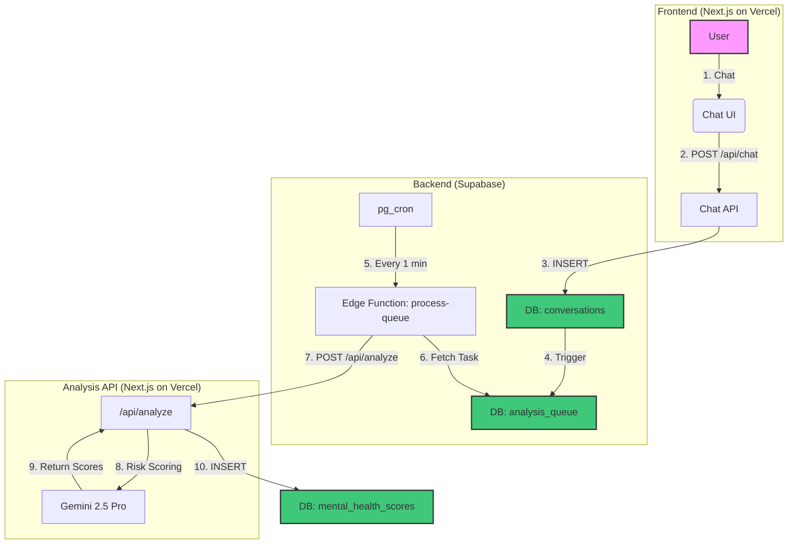

# Near (ニア)

<br>

> きみの、いちばん近くに。

<br>

[](https://nextjs.org/)
[](https://reactjs.org/)
[](https://www.typescriptlang.org/)
[](https://tailwindcss.com/)
[](https://ui.shadcn.com/)
[](https://gemini.google.com/)
[](https://supabase.com/)
[](https://authjs.dev/)
[](https://vercel.com/)

**Near (ニア)** は、子どもたちが感情豊かな3Dキャラクターと自由に対話できる、スマートフォン向けのAIチャットアプリケーションです。

嬉しかったこと、悩みごと、誰にも言えない本音まで。ニアは最高の友達として、いつでも子どもの心に寄り添います。

このプロジェクトは単なるチャットアプリではありません。

子どものプライバシーを最大限に尊重しながら、保護者には「監視」ではない、新しい「見守り」の形を提供することをミッションとしています。

---

## 🚀 デモサイト (Live Demo)

**ニアとの対話は、アカウント登録不要で今すぐ体験できます！**
<br/>
(スマートフォンでの閲覧を強く推奨します)

### [https://near.new](https://near.new)

---

## 🖼️ スクリーンショット (Screenshot)


---

## 💎 ニアが大切にしていること

私たちは、テクノロジーが親子の断絶ではなく、架け橋になるべきだと信じています。そのために、ニアは「何を見せないか」を徹底的にデザインしました。

### 「監視」ではなく、心を通わす「見守り」を。

子どもの具体的な会話内容を見せるのは論外です。私たちはさらに踏み込み、「ネガティブな発言が何回あったか」といった**数字やグラフですら、保護者の不安を煽り、詮索のきっかけになりうる**と考えます。

ニアが目指すのは、保護者に「何かあったのかな？」と**対話のきっかけ**を与え、詮索ではなく、**親子のコミュニケーションを優しく促すこと**です。

| 私たちが提供する「見守り」 | 私たちが提供しない「監視」 |
|:--- |:--- |
| ✅ **コミュニケーションの天気予報** <br>具体的な数字ではなく、「いつもよりお話し好きみたい」「少し静かな一週間かも」といった、心の機微を感じさせる穏やかな言葉で変化を伝えます。 | ❌ **ネガティブ感情のグラフや回数** <br>子どもがネガティブな感情を表現するのは、心の健康に必要なプロセスです。それを問題としてラベリングしません。 |
| ✅ **対話のきっかけ** <br>「最近、好きな遊びに関心があるようです」のように、プライバシーを守りつつ、親子が話すきっかけになるヒントを提供します。 | ❌ **具体的なトピックの提示** <br>「〇〇というゲームについて話していました」といった情報は、プライバシーの侵害につながります。 |
| ✅ **本当に深刻なリスクが検知された場合のアラート** <br>AIが深刻な心の負担を示すサインを繰り返し検知した場合にのみ、特別な通知と公的な相談窓口への案内を表示します。 | ❌ **一時的な気分の落ち込みの警告** <br>頻繁な警告は信頼性を損ない、保護者の過度な心配を引き起こします。 |

---

## ✨ Nearでできること

### お子様にとって

*   **最高の話し相手**
    **Googleの最新AI `Gemini 2.5 Pro`** を搭載したニアは、ただのチャットボットではありません。文脈を深く理解し、あなたの気持ちに寄り添い、時にはユーモアを交えながら、世界で一番の話し相手になります。

*   **生きているような存在感**
    `@pixiv/three-vrm` で描かれるニアは、あなたの言葉にリアルタイムで反応します。嬉しいときには笑顔になり、考え込むときには少し首をかしげる。音声に合わせて口を動かし、優しく瞬きをする。まるでビデオ通話の向こうに、本当に友達がいるかのような温かい体験を提供します。

*   **絶対的な安心感**
    ニアとの会話は、あなたとニアだけの秘密です。誰かに見られたり、勝手に判断されたりすることはありません。どんなことでも安心して話せる、あなただけの特別な場所です。

### 保護者の方にとって

*   **そっと、見守る**
    ダッシュボードを開けば、お子様の今のコミュニケーション状態が「コミュニケーション・ウェザー」として表示されます。具体的な数字ではなく、「今週は心が晴れやかなようです」といった天気予報のような穏やかな言葉で、お子様の様子をさりげなく感じ取ることができます。

*   **いざという時のお知らせ**
    普段はレーダーのような波紋で「常に見守っている」ことだけを静かに示します。しかし、AIがお子様の心に継続的で深刻な負担のサインを検知した場合にのみ、特別な「大切なお知らせ」を表示。詮索ではなく、専門家への相談という具体的な次の一歩をサポートします。

*   **かんたんで安全な利用**
    あなたがお子様専用のQRコードを発行し、お子様はそれをスマートフォンのカメラで読み込むだけ。パスワード管理の必要なく、すぐに安全に利用を開始できます。

---

## 🛠️ 技術スタック (Tech Stack)

| カテゴリ | 技術・サービス |
| :--- | :--- |
| **Frontend** | [Next.js (App Router)](https://nextjs.org/), [React](https://reactjs.org/), [TypeScript](https://www.typescriptlang.org/), [Tailwind CSS](https://tailwindcss.com/), [shadcn/ui](https://ui.shadcn.com/), [Framer Motion](https://www.framer.com/motion/) |
| **3D / VRM** | [Three.js](https://threejs.org/), [@react-three/fiber](https://docs.pmnd.rs/react-three-fiber), [@react-three/drei](https://github.com/pmndrs/drei), [@pixiv/three-vrm](https://github.com/pixiv/three-vrm) |
| **Backend & AI** | [Google Gemini API (1.5 Pro/Flash)](https://ai.google.dev/), [Vercel Serverless Functions](https://vercel.com/docs/functions) |
| **Database** | [Supabase](https://supabase.com/) (PostgreSQL, Realtime, Storage, Auth) |
| **Serverless (Async)**| [Supabase Edge Functions](https://supabase.com/docs/guides/functions) (Deno), [Supabase pg_cron](https://supabase.com/docs/guides/database/extensions/pg_cron) |
| **Authentication** | [Auth.js (NextAuth.js v5)](https://authjs.dev/), Google Provider, Credentials Provider |
| **Infrastructure** | [Vercel](https://vercel.com/) |

---

## 🏗️ アーキテクチャ (Architecture)

このアプリケーションは、会話の保存と、その会話の重い分析処理を**非同期**で行うことで、ユーザー体験を損なうことなく、堅牢でスケーラブルなシステムを実現しています。



1.  **会話**: ユーザーがフロントエンドでメッセージを送信します。
2.  **API呼び出し**: Next.jsのChat API (`/api/chat`) が呼び出されます。
3.  **会話保存**: APIはSupabaseの`conversations`テーブルに会話データを即座に保存します。**ユーザーへの応答はこの時点で完了します。**
4.  **トリガー発火**: 会話の保存をトリガーに、分析リクエストが`analysis_queue`テーブルにタスクとして追加されます。
5.  **定期実行**: `pg_cron`が1分ごとにEdge Functionを呼び出します。
6.  **タスク取得**: Edge Functionは`analysis_queue`から未処理のタスクを取得します。
7.  **分析API呼び出し**: Edge FunctionはNext.jsの分析API (`/api/analyze`)を呼び出します。
8.  **リスク分析**: 分析APIがGemini 1.5 Proを使って会話のリスクスコアを計算します。
9.  **スコア返却**: GeminiがJSON形式でスコアを返します。
10. **結果保存**: 分析結果が`mental_health_scores`テーブルに保存されます。

---

## 🚀 ローカル環境での実行 (Getting Started)

### 前提条件
*   [Node.js](https://nodejs.org/) (v18.17 or later)
*   [Docker](https://www.docker.com/products/docker-desktop/) (実行されていること)
*   [Supabase CLI](https://supabase.com/docs/guides/cli)

### 1. リポジトリのクローン
```bash
git clone https://github.com/[YOUR_USERNAME]/near.git
cd near
```

### 2. パッケージのインストール
```bash
npm install
```

### 3. Supabase プロジェクトのセットアップ
1. Supabaseにログインし、新しいプロジェクトを作成します。
2. プロジェクトのルートで、ローカル環境とSupabaseプロジェクトをリンクします。
   ```bash
   supabase login
   supabase link --project-ref [YOUR_SUPABASE_PROJECT_ID]
   ```
3. Supabaseのマイグレーションを適用して、データベーススキーマをセットアップします。
   ```bash
   supabase db push
   ```
   (注: このリポジトリにマイグレーションファイルが含まれている場合のコマンドです。ない場合はスキーマを手動で適用する必要があります。)

### 4. 環境変数の設定
`.env.local.example` をコピーして `.env.local` を作成し、ご自身のSupabaseプロジェクトのURL、キー、およびGoogle Cloud、Auth.jsの認証情報を入力してください。

```bash
cp .env.local.example .env.local
```

### 5. ローカルサーバーの起動
```bash
npm run dev
```

ブラウザで `http://localhost:3000` を開いてください。

---

## 展望 (Future Work)

- [ ] **通知システムの拡充**: アラートをメールだけでなくLINEなどでも通知
- [ ] **キャラクターの多様化**: ユーザーが対話するキャラクターを選択・カスタマイズできる機能
- [ ] **ダッシュボードの進化**: 会話頻度の推移をグラフで表示するなど、よりリッチな可視化
- [ ] **音声入力への対応**: テキストだけでなく、音声での入力機能

---

## ©️ ライセンス (License)

This project is licensed under the MIT License.
